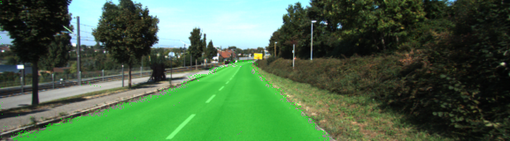

# Semantic Segmentation



This project is in conjunction with the Udacity Self-Driving Car course.  In particular, the goal of this project is to implement a fully convolutional network to classify pixels in images of traffic scenes from the Kitti Road Dataset as either "road surface" or "not road surface".

* More detail about the approach is provided in [writeup.md](./writeup.md).

## Getting Started

### Prerequisites

```
Python 3
TensorFlow
Numpy
Scipy
Kitti Road Dataset
```

### Installing

1. Clone this project from GitHub:

```
git clone https://github.com/jimwatt/P12-semanticsegmentation.git
```

## Running the Code

* Run the `main.py` script to train the network, and perform inference on sample images: 

  ```
  python3 main.py
  ```

* The script will check that a GPU is available, and then begin training.  

* Results of inference on test images will be placed in a `runs` directory.

## Authors

* **James Watt**

<!--## License

This project is licensed under the MIT License - see the [LICENSE.md](LICENSE.md) file for details-->

## Acknowledgments
This project is a submission to the Udacity Self-Driving Car nanodegree:

* `https://github.com/udacity/CarND-Semantic-Segmentation.git`

## Semantic Segmentation

------

**Classification of Image pixels into *Road* and *Non-Road***

The goals / steps of this project are the following:

- Implement a fully convolutional network to classify pixels in images of traffic scenes from the Kitti Road dataset as either "road surface" or "not road surface".  
- The network is a fully-convolutional encoder-decoder network in which the encoder is the previously trained VGG network. 

## Rubric Points

### 1. Build the Neural Network

**Does the project load the pretrained vgg model?**

- Done.  The function `load_vgg` is implemented correctly.

**Does the project learn the correct features from the images?**

- Done. The function `layers` is implemented correctly.

**Does the project optimize the neural network?**

- Done. The function `optimize` is implemented correctly.

**Does the project train the neural network?**

- Done.The function `train_nn` is implemented correctly. The loss of the network is printed while the network is training.

### 2. Neural Network Training

**Does the project train the model correctly?**

- Done.  On average, the model decreases loss over time:

  - EPOCH 0
    Loss: = 57.181
    Loss: = 154.787
    Loss: = 23.549
    Loss: = 29.841
    Loss: = 13.137
    Loss: = 8.094
    Loss: = 5.729
    Loss: = 3.913
    Loss: = 2.815
    Loss: = 2.264
    Loss: = 1.762
    Loss: = 1.699
    Loss: = 1.388
    Loss: = 0.997
    Loss: = 0.954
    Loss: = 1.022
    Loss: = 0.993
    Loss: = 0.974
    Loss: = 0.883

    ......

  - EPOCH 20
    Loss: = 0.323
    Loss: = 0.376
    Loss: = 0.298
    Loss: = 0.270
    Loss: = 0.278
    Loss: = 0.285
    Loss: = 0.289
    Loss: = 0.254
    Loss: = 0.272
    Loss: = 0.245
    Loss: = 0.253
    Loss: = 0.238
    Loss: = 0.225
    Loss: = 0.210
    Loss: = 0.221
    Loss: = 0.207
    Loss: = 0.215
    Loss: = 0.235
    Loss: = 0.135

    .......

  - EPOCH 39
    Loss: = 0.087
    Loss: = 0.078
    Loss: = 0.088
    Loss: = 0.105
    Loss: = 0.090
    Loss: = 0.092
    Loss: = 0.079
    Loss: = 0.114
    Loss: = 0.093
    Loss: = 0.094
    Loss: = 0.097
    Loss: = 0.106
    Loss: = 0.084
    Loss: = 0.088
    Loss: = 0.086
    Loss: = 0.088
    Loss: = 0.090
    Loss: = 0.094
    Loss: = 0.108

**Does the project use reasonable hyperparameters?**

- Done.  The number of epoch and batch size are set to a reasonable number.
  - Number of epochs: 40
  - Batch size: 16

**Does the project correctly label the road?**

- Done.  The project labels most pixels of roads close to the best solution.

- See sample inference images in the [inference_images](./inference_images) directory:

  

  

  

  


